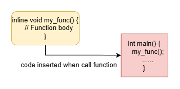
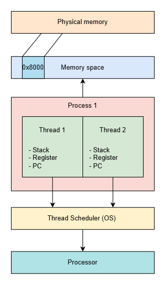
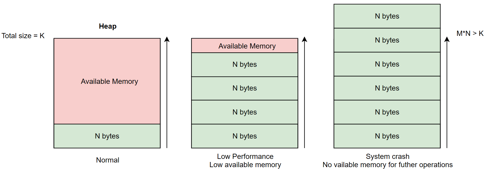

# C Foundation - Memory Management

Tài liệu này cung cấp kiến thức nền tảng về quản lý bộ nhớ trong ngôn ngữ lập trình C, bao gồm các ví dụ code demo minh họa các lỗi phổ biến và cách xử lý.

## 📑 Mục lục

- [📁 Mô tả Code Demo](#-mô-tả-code-demo)
  - [1. Memory Leak](#1-memory-leak-memory-leakmemory-leakc)
  - [2. Out of Memory](#2-out-of-memory-out-of-memoryallocation-mallocc)
  - [3. Stack Overflow](#3-stack-overflow)
- [🔧 Hướng dẫn viết Makefile](#-hướng-dẫn-viết-makefile)
- [📚 Tips và Kiến thức từ Documentation](#-tips-và-kiến-thức-từ-documentation)
  - [1. Kiểm tra phân vùng bộ nhớ](#1-kiểm-tra-phân-vùng-bộ-nhớ-của-biến-memory-layout)
  - [2. Quản lý bộ nhớ](#2-quản-lý-bộ-nhớ-memory-management)
    - [2.1. Tiêu chuẩn C99 và C11](#21-tiêu-chuẩn-c99-và-c11)
    - [2.2. Cấu trúc bộ nhớ](#22-cấu-trúc-bộ-nhớ-memory-layout)
    - [2.3. Stack Frame](#23-stack-frame-và-stack-pointer)
    - [2.4. Các lỗi bộ nhớ phổ biến](#24-các-lỗi-bộ-nhớ-phổ-biến)

---

## 📁 Mô tả Code Demo

Thư mục `code-demo` chứa các ví dụ minh họa các lỗi bộ nhớ phổ biến trong C:

### 1. Memory Leak (`memory-leak/memory-leak.c`)
**Mục đích:** Minh họa lỗi rò rỉ bộ nhớ (memory leak)

**Mô tả:** 
- Chương trình cấp phát bộ nhớ liên tục trong vòng lặp (1KB mỗi lần)
- Không giải phóng bộ nhớ đã cấp phát (`free()` bị comment)
- Dẫn đến tiêu thụ bộ nhớ tăng dần cho đến khi hệ thống cạn kiệt tài nguyên
- Kết quả: Out of Memory hoặc bị OOM Killer chấm dứt tiến trình

### 2. Out of Memory (`out-of-memory/allocation-malloc.c`)
**Mục đích:** Minh họa lỗi cạn kiệt bộ nhớ khi cấp phát

**Mô tả:**
- Cố gắng cấp phát một khối bộ nhớ cực lớn (~1TB)
- Kiểm tra giá trị trả về của `malloc()` để phát hiện lỗi
- Xử lý trường hợp `malloc()` trả về `NULL` khi không đủ bộ nhớ
- Minh họa cách xử lý lỗi OOM đúng cách

### 3. Stack Overflow

#### a. Đệ quy vô hạn (`stack-overflow/recursive.c`)
**Mục đích:** Minh họa stack overflow do đệ quy vô hạn

**Mô tả:**
- Hàm tự gọi lại chính nó không có điều kiện dừng
- Mỗi lần gọi tạo một stack frame mới
- Stack bị tràn khi số lượng stack frame vượt quá giới hạn
- Chương trình sẽ crash với segmentation fault

#### b. Mảng cục bộ quá lớn (`stack-overflow/initial-large-array.c`)
**Mục đích:** Minh họa stack overflow do cấp phát mảng lớn trên stack

**Mô tả:**
- Khai báo mảng cục bộ có kích thước rất lớn (~20MB) trên stack
- Stack có kích thước giới hạn (thường 1-8MB)
- Cấp phát mảng lớn hơn giới hạn stack gây tràn ngăn xếp
- Giải pháp: Sử dụng cấp phát động trên heap với `malloc()`

---

## 🔧 Hướng dẫn viết Makefile

### Makefile cơ bản để biên dịch các code demo:

```makefile
# Compiler và flags
CC = gcc
CFLAGS = -Wall -Wextra -g

# Thư mục
CODE_DEMO = code-demo
BUILD_DIR = build

# Tạo thư mục build nếu chưa tồn tại
$(BUILD_DIR):
	mkdir -p $(BUILD_DIR)

# Biên dịch tất cả các demo
all: $(BUILD_DIR) memory-leak oom stack-overflow-recursive stack-overflow-array

# Memory Leak Demo
memory-leak: $(CODE_DEMO)/memory-leak/memory-leak.c
	$(CC) $(CFLAGS) -o $(BUILD_DIR)/memory-leak $<

# Out of Memory Demo
oom: $(CODE_DEMO)/out-of-memory/allocation-malloc.c
	$(CC) $(CFLAGS) -o $(BUILD_DIR)/oom $<

# Stack Overflow - Recursive Demo
stack-overflow-recursive: $(CODE_DEMO)/stack-overflow/recursive.c
	$(CC) $(CFLAGS) -o $(BUILD_DIR)/stack-overflow-recursive $<

# Stack Overflow - Large Array Demo
stack-overflow-array: $(CODE_DEMO)/stack-overflow/initial-large-array.c
	$(CC) $(CFLAGS) -o $(BUILD_DIR)/stack-overflow-array $<

# Chạy các demo
run-memory-leak: memory-leak
	./$(BUILD_DIR)/memory-leak

run-oom: oom
	./$(BUILD_DIR)/oom

run-stack-recursive: stack-overflow-recursive
	./$(BUILD_DIR)/stack-overflow-recursive

run-stack-array: stack-overflow-array
	./$(BUILD_DIR)/stack-overflow-array

# Dọn dẹp
clean:
	rm -rf $(BUILD_DIR)

.PHONY: all clean run-memory-leak run-oom run-stack-recursive run-stack-array
```

### Cách sử dụng Makefile:

```bash
# Biên dịch tất cả
make all

# Biên dịch từng demo riêng lẻ
make memory-leak
make oom
make stack-overflow-recursive
make stack-overflow-array

# Chạy demo
make run-memory-leak
make run-oom
make run-stack-recursive
make run-stack-array

# Dọn dẹp
make clean
```

---

## 📚 Tips và Kiến thức từ Documentation

### 1. Kiểm tra phân vùng bộ nhớ của biến (Memory Layout)

Trong tài liệu này chúng ta sẽ tìm hiểu về phân vùng bộ nhớ Memory Layout của chương trình C thông qua ví dụ code sau:

```c
#include <stdio.h>
#include <stdlib.h>

/* --- .data section: biến global có khởi tạo --- */
int g_data = 10;

/* --- .bss section: biến global không khởi tạo --- */
int g_bss;

/* --- .rodata section: biến hằng --- */
const char g_rodata[] = "Hello, RO data";

/* --- .text section: hàm của chương trình --- */
void func_demo(void) {
    /* empty */
}

int main(void) {
    /* --- Stack --- */
    int stack_var = 123;

    /* --- Heap --- */
    int *heap_var = (int*)malloc(sizeof(int));
    *heap_var = 999;

    printf("====== MEMORY LAYOUT DEMO ======\n");
    
    free(heap_var);
    return 0;
}
```

Sau khi biên dịch chương trình chúng ta chạy lệnh `nm` trên Linux để theo dõi các biến trong code thuộc phân vùng nào.

```bash
gcc -o demo main.c 
nm -S demo
```

Ta thu được kết quả:
```bash
toanonestar@toan:~/test$ nm -S demo 
000000000000038c 0000000000000020 r __abi_tag
0000000000004014 B __bss_start
0000000000004014 0000000000000001 b completed.0
                 w __cxa_finalize@GLIBC_2.2.5
0000000000004000 D __data_start
0000000000004000 W data_start
00000000000010d0 t deregister_tm_clones
0000000000001140 t __do_global_dtors_aux
0000000000003db0 d __do_global_dtors_aux_fini_array_entry
0000000000004008 D __dso_handle
0000000000003db8 d _DYNAMIC
0000000000004014 D _edata
0000000000004020 B _end
00000000000011e4 T _fini
0000000000001180 t frame_dummy
0000000000003da8 d __frame_dummy_init_array_entry
0000000000002140 r __FRAME_END__
                 U free@GLIBC_2.2.5
0000000000001189 000000000000000b T func_demo
0000000000004018 0000000000000004 B g_bss
0000000000004010 0000000000000004 D g_data
0000000000003fa8 d _GLOBAL_OFFSET_TABLE_
                 w __gmon_start__
000000000000203c r __GNU_EH_FRAME_HDR
0000000000002008 000000000000000f R g_rodata
0000000000001000 T _init
0000000000002000 0000000000000004 R _IO_stdin_used
                 w _ITM_deregisterTMCloneTable
                 w _ITM_registerTMCloneTable
                 U __libc_start_main@GLIBC_2.34
0000000000001194 000000000000004d T main
                 U malloc@GLIBC_2.2.5
                 U puts@GLIBC_2.2.5
0000000000001100 t register_tm_clones
00000000000010a0 0000000000000026 T _start
0000000000004018 D __TMC_END__
```

Từ đó ta có thể tra phân vùng của biến trong bảng sau:

| Ký hiệu   | Phân vùng        | Ý nghĩa                                              |
| --------- | ---------------- | ---------------------------------------------------- |
| **T / t** | `.text`          | Code (hàm thực thi)                                  |
| **D / d** | `.data`          | Biến global **khởi tạo ≠ 0**                         |
| **B / b** | `.bss`           | Biến global **không khởi tạo** hoặc **khởi tạo = 0** |
| **R / r** | `.rodata`        | Hằng số, dữ liệu chỉ đọc                             |
| **U**     | Unresolved       | Symbol từ thư viện ngoài                             |
| **W**     | Weak symbol      | Symbol yếu                                           |
| **w**     | weak, local      |                                                      |
| **r**     | read-only, local |                                                      |
| **d**     | data local       |                                                      |
| **b**     | bss local        |                                                      |

---

### 2. Quản lý bộ nhớ (Memory Management)

#### 2.1. Tiêu chuẩn C99 và C11

##### **C99 - Các tính năng chính**

C99 (ISO/IEC 9899:1999) giới thiệu nhiều tính năng mới quan trọng:

**Mảng có độ dài biến đổi (VLA - Variable-Length Arrays)**
- Cho phép khai báo mảng với kích thước xác định tại runtime
- Cấp phát trên stack, linh hoạt nhưng có nguy cơ stack overflow


**Hàm nội tuyến (Inline Functions)**
- Sử dụng từ khóa `inline` để đề xuất trình biên dịch chèn mã trực tiếp
- Giảm chi phí gọi hàm, tăng hiệu suất



**Các tính năng khác:**
- Bình luận một dòng với `//`
- Kiểu dữ liệu `long long int`
- Khởi tạo được chỉ định (Designated Initializers)
- Hỗ trợ số phức (Complex Numbers)
- Flexible Array Members

##### **C11 - Các tính năng chính**

C11 (ISO/IEC 9899:2011) tập trung vào đa luồng và bảo mật:

**Hỗ trợ đa luồng**
- Bộ chỉ định `_Thread_local` cho biến cục bộ của luồng
- Thư viện `<threads.h>` với mutex, condition variables



**Cải tiến bảo mật:**
- Loại bỏ hàm `gets()` không an toàn (dễ gây buffer overflow)
- Khuyến khích dùng `fgets()` thay thế

**Các tính năng khác:**
- Biểu thức kiểu chung `_Generic`
- Khẳng định tĩnh `_Static_assert`
- Hỗ trợ Unicode cải tiến
- Cấu trúc và union ẩn danh

---

#### 2.2. Cấu trúc bộ nhớ (Memory Layout)

Bộ nhớ của chương trình C được chia thành 5 phân đoạn chính:


##### **1. Text Segment**
- **Chức năng:** Lưu trữ mã máy đã biên dịch
- **Đặc điểm:** 
  - Chỉ đọc (read-only) để tránh sửa đổi mã
  - Có thể chia sẻ giữa nhiều tiến trình
  - Nằm ở địa chỉ thấp của bộ nhớ ảo

##### **2. Data Segment (Initialized Data)**
- **Chức năng:** Lưu biến global và static đã khởi tạo ≠ 0
- **Ví dụ:**
  ```c
  int a = 5;
  static int b = 1;
  ```
- **Đặc điểm:** Có quyền đọc-ghi (read-write)


##### **3. BSS Segment (Uninitialized Data)**
- **Chức năng:** Lưu biến global/static chưa khởi tạo hoặc = 0
- **Ví dụ:**
  ```c
  int a;
  int b = 0;
  ```
- **Đặc điểm:** 
  - Tự động khởi tạo = 0 hoặc NULL
  - Không lưu giá trị 0 trong file thực thi (tiết kiệm dung lượng)

##### **4. Heap Segment**
- **Chức năng:** Cấp phát bộ nhớ động tại runtime
- **Quản lý:** `malloc()`, `calloc()`, `realloc()`, `free()`
- **Đặc điểm:** 
  - Phát triển về địa chỉ cao hơn (grows upward)
  - Phải tự quản lý (cấp phát và giải phóng)
  - Không giải phóng → Memory Leak

##### **5. Stack Segment**
- **Chức năng:** Lưu biến cục bộ, tham số hàm, quản lý lời gọi hàm
- **Cơ chế:** LIFO (Last In First Out)
- **Đặc điểm:**
  - Phát triển về địa chỉ thấp hơn (grows downward)
  - Tự động quản lý (tạo/hủy stack frame)
  - Kích thước giới hạn (thường 1-8MB)


**Tương tác Stack và Heap:**


- Stack và Heap tăng trưởng ngược chiều nhau
- Khi gặp nhau → hết bộ nhớ (Stack Overflow hoặc OOM)

---

#### 2.3. Stack Frame và Stack Pointer

##### **Stack Frame là gì?**

Stack Frame (Activation Record) là cấu trúc dữ liệu được tạo mỗi khi gọi hàm, chứa:


**Các thành phần:**
1. **Tham số hàm (Passed Arguments):** Giá trị truyền vào hàm
2. **Địa chỉ trả về (Return Address):** Địa chỉ lệnh tiếp theo sau khi hàm kết thúc
3. **Biến cục bộ (Local Variables):** Biến khai báo trong hàm
4. **Frame Pointer (FP/BP):** Trỏ đến vị trí cố định trong khung
5. **Saved Registers:** Các thanh ghi cần bảo toàn

##### **Stack Pointer (SP)**

- Thanh ghi đặc biệt luôn trỏ đến đỉnh stack
- **Push:** Giảm SP (trên kiến trúc stack grows down)
- **Pop:** Tăng SP

##### **Đệ quy và Stack Frame**


- Mỗi lời gọi đệ quy tạo stack frame mới
- Đệ quy sâu/vô hạn → Stack Overflow

---

#### 2.4. Các lỗi bộ nhớ phổ biến

##### **A. Stack Overflow**


**Nguyên nhân:**
1. **Đệ quy vô hạn:** Hàm tự gọi không có điều kiện dừng
2. **Đệ quy quá sâu:** Độ sâu vượt quá giới hạn stack
3. **Mảng cục bộ quá lớn:** Khai báo mảng lớn hơn kích thước stack
4. **Môi trường hạn chế:** Đa luồng, hệ thống nhúng

**Cách phòng tránh:**
- ✅ Chuyển đệ quy sang lặp
- ✅ Sử dụng Tail-call optimization (TCO)
- ✅ Giới hạn độ sâu đệ quy
- ✅ Cấp phát mảng lớn trên heap với `malloc()`
- ⚠️ Tăng kích thước stack (chỉ là giải pháp tạm thời)

##### **B. Out of Memory (OOM)**


**Nguyên nhân:**
1. Cấp phát bộ nhớ quá lớn
2. Memory leak (cấp phát liên tục không giải phóng)
3. Phân mảnh bộ nhớ
4. Cơ chế overcommit của Linux

**Cách xử lý:**
```c
int *ptr = (int *)malloc(size);
if (ptr == NULL) {
    printf("Out of Memory!\n");
    return 1;
}
// Sử dụng ptr
free(ptr);
```

**Chiến lược:**
- ✅ Luôn kiểm tra giá trị trả về của `malloc()`
- ✅ Pre-allocation và memory pool
- ✅ Giám sát bộ nhớ chủ động
- ✅ Sử dụng `mmap` với file backing
- ✅ Ghi log bằng syslog

##### **C. Memory Leak**



**Định nghĩa:** Cấp phát bộ nhớ động nhưng không giải phóng khi không dùng

**Nguyên nhân:**
1. Quên gọi `free()`
2. Mất tham chiếu đến bộ nhớ đã cấp phát
3. Gán lại con trỏ không đúng cách
4. Không giải phóng trong đường dẫn lỗi
5. Cấp phát trong vòng lặp không giải phóng

**Ví dụ lỗi:**
```c
int *ptr = (int*)malloc(sizeof(int) * 10);
ptr = NULL; // Mất dấu vết bộ nhớ → Memory Leak!
```

**Cách phát hiện:**
1. **Kiểm tra thủ công:** Đảm bảo mỗi `malloc()` có `free()` tương ứng
2. **Valgrind:**
   ```bash
   gcc -g -o program program.c
   valgrind --leak-check=yes ./program
   ```
3. **GDB:** Gỡ lỗi và theo dõi bộ nhớ
4. **Electric Fence:** Phát hiện buffer overflow và leak
5. **mtrace():** Thư viện GNU C
6. **Bộ đếm:** Biến toàn cục theo dõi số lần cấp phát/giải phóng

**Best Practices:**
```c
void goodPractice() {
    int *ptr = (int*)malloc(sizeof(int) * 10);
    if (ptr == NULL) return;
    
    // Sử dụng ptr
    
    free(ptr);  // ✅ Luôn giải phóng
    ptr = NULL; // ✅ Tránh dangling pointer
}
```

---

## 🎯 Kết luận

Quản lý bộ nhớ trong C đòi hỏi:
- ✅ Hiểu rõ cấu trúc bộ nhớ (Text, Data, BSS, Heap, Stack)
- ✅ Nắm vững cơ chế Stack Frame và Stack Pointer
- ✅ Phòng tránh Stack Overflow, OOM, Memory Leak
- ✅ Sử dụng công cụ phân tích (Valgrind, GDB)
- ✅ Luôn kiểm tra và giải phóng bộ nhớ đúng cách

**Nguyên tắc vàng:**
> "Mỗi `malloc()` phải có một `free()` tương ứng!"

---

## 📖 Tài liệu tham khảo

- ISO/IEC 9899:1999 (C99 Standard)
- ISO/IEC 9899:2011 (C11 Standard)
- Code demo trong `code-demo/` để thực hành

