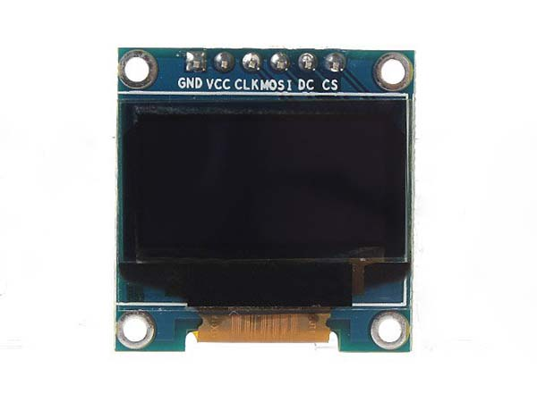

# Danh sách thiết bị sử dụng trong khóa học Embedded Linux

Tài liệu này liệt kê các thiết bị, module và phụ kiện cần có để thực hành xuyên suốt khóa học.

## Thiết bị chính sử dụng cho khóa học Embedded Linux

**Raspberry Pi Zero**: board Linux giá rẻ, phù hợp cho người mới học.

## Các module và thiết bị ngoại vi

**SSD1306 OLED - I2C**: màn hình nhỏ hiển thị thông tin khi lập trình Linux GPIO thông qua giao thức I2C.

**SSD1306 OLED - SPI**: màn hình nhỏ hiển thị thông tin khi lập trình Linux GPIO thông qua giao thức SPI.

**CP2102 USB-to-UART**: module chuyển đổi USB sang UART dùng để debug và giao tiếp serial với thiết bị.

## Phụ kiện cần thiết

* Thẻ nhớ microSD 16–32GB (Class 10)
* Đầu đọc thẻ microSD
* Nguồn adapter 5V–2A
* Cáp Micro USB / USB-C tùy board
* Máy tính Windows / Ubuntu
* Internet để cài công cụ và cập nhật
* Led, button
* Các loại dây cắm đực-đực, đực-cái, cái-cái
