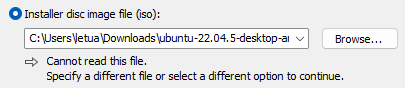
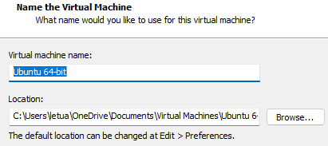
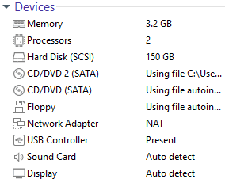
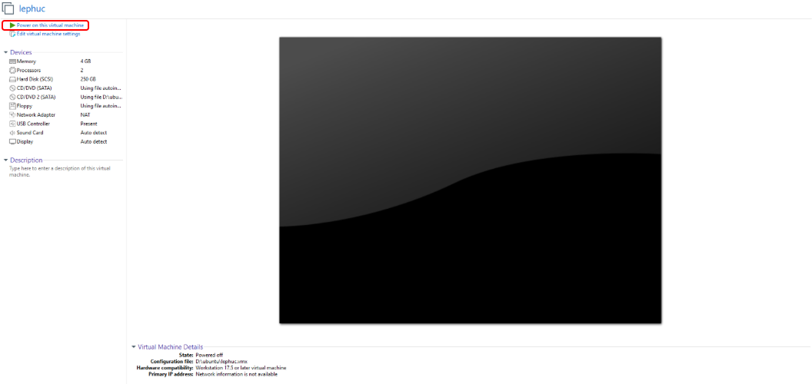
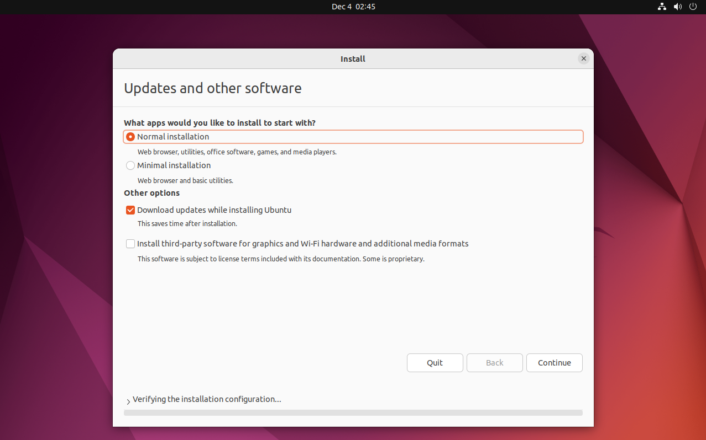
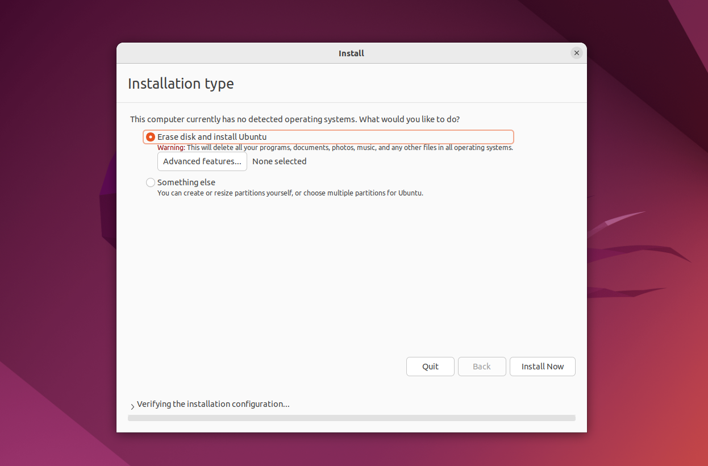
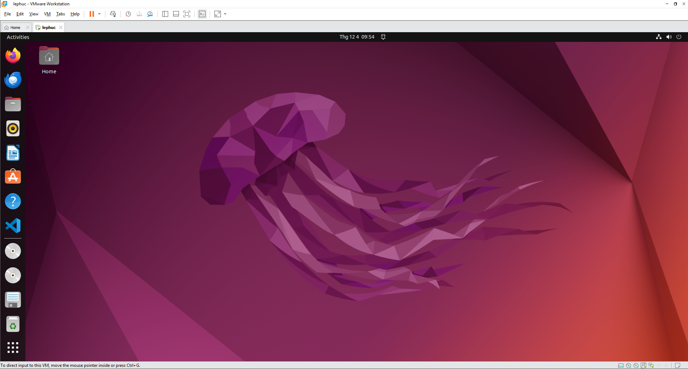

# Hướng dẫn cài đặt Ubuntu 22.04 LTS trên VMware Workstation

Tài liệu này hướng dẫn chi tiết cách tạo máy ảo VMware, cài đặt Ubuntu 22.04 LTS và thiết lập môi trường làm việc cơ bản.

---

## 📑 Mục lục

- [Hướng dẫn cài đặt Ubuntu 22.04 LTS trên VMware Workstation](#hướng-dẫn-cài-đặt-ubuntu-2204-lts-trên-vmware-workstation)
  - [📑 Mục lục](#-mục-lục)
  - [1. Chuẩn bị file ISO](#1-chuẩn-bị-file-iso)
  - [2. Tạo máy ảo trong VMware](#2-tạo-máy-ảo-trong-vmware)
    - [🔸 Bước 1: Chọn file ISO](#-bước-1-chọn-file-iso)
    - [🔸 Bước 2: Chọn hệ điều hành](#-bước-2-chọn-hệ-điều-hành)
    - [🔸 Bước 3: Đặt tên máy ảo và thư mục lưu](#-bước-3-đặt-tên-máy-ảo-và-thư-mục-lưu)
    - [🔸 Bước 4: Chọn dung lượng ổ đĩa](#-bước-4-chọn-dung-lượng-ổ-đĩa)
    - [🔸 Bước 5: Hoàn tất cấu hình](#-bước-5-hoàn-tất-cấu-hình)
    - [Thông số cấu hình khuyến nghị](#thông-số-cấu-hình-khuyến-nghị)
  - [3. Cài đặt Ubuntu trên máy ảo](#3-cài-đặt-ubuntu-trên-máy-ảo)
    - [Bước 1: Chọn ngôn ngữ](#bước-1-chọn-ngôn-ngữ)
    - [Bước 2: Update \& Other Software](#bước-2-update--other-software)
    - [Bước 3: Installation Type](#bước-3-installation-type)
    - [Bước 4: Thiết lập vị trí và bàn phím](#bước-4-thiết-lập-vị-trí-và-bàn-phím)
    - [Bước 5: Tạo tài khoản người dùng](#bước-5-tạo-tài-khoản-người-dùng)
  - [4. Cài đặt công cụ cần thiết](#4-cài-đặt-công-cụ-cần-thiết)
  - [5. (Khuyến nghị) Cài đặt VMware Tools](#5-khuyến-nghị-cài-đặt-vmware-tools)
    - [Cách cài:](#cách-cài)

---

## 1. Chuẩn bị file ISO

1. Truy cập trang tải Ubuntu:  
   https://ubuntu.com/download/desktop  
2. Chọn phiên bản **Ubuntu 22.04.4 LTS** hoặc mới hơn rồi tải file ISO.

---

## 2. Tạo máy ảo trong VMware

1. Mở VMware Workstation → chọn **Create a New Virtual Machine**.  
2. Chọn **Installer disc image file (ISO)** → duyệt đến file ISO đã tải.

---

### 🔸 Bước 1: Chọn file ISO



---

### 🔸 Bước 2: Chọn hệ điều hành


---

### 🔸 Bước 3: Đặt tên máy ảo và thư mục lưu



---

### 🔸 Bước 4: Chọn dung lượng ổ đĩa


> Gợi ý: 80–150GB tùy mục đích sử dụng.

---

### 🔸 Bước 5: Hoàn tất cấu hình

Nhấn **Finish** để tạo máy ảo.


---

### Thông số cấu hình khuyến nghị

| Thành phần | Giá trị |
|-----------|---------|
| RAM | **4GB** (khuyến nghị 8GB) |
| CPU | **2 cores** |
| Disk | **150GB** |

---

Sau khi tạo xong máy ảo:



---

## 3. Cài đặt Ubuntu trên máy ảo

Nhấn **Power on this virtual machine** để khởi động.



---

### Bước 1: Chọn ngôn ngữ

Chọn **English** → Continue.


---

### Bước 2: Update & Other Software

Chọn chế độ mặc định để cài các gói cơ bản.



---

### Bước 3: Installation Type

Chọn **Erase disk and install Ubuntu** (an toàn trên máy ảo).



---

### Bước 4: Thiết lập vị trí và bàn phím

Giữ mặc định:

- Timezone: **Asia/Ho_Chi_Minh**
- Keyboard: **English (US)**

---

### Bước 5: Tạo tài khoản người dùng

Điền thông tin:

- Your name  
- Computer name  
- Username  
- Password  

Sau đó Ubuntu sẽ bắt đầu cài đặt.



---

## 4. Cài đặt công cụ cần thiết

Sau khi vào Desktop, mở Terminal (`Ctrl + Alt + T`) và chạy:

```bash
sudo apt update
sudo apt install build-essential git curl vim -y
```


---

## 5. (Khuyến nghị) Cài đặt VMware Tools

VMware Tools giúp:

- Tự động scale màn hình  
- Kéo thả file Windows ↔ Ubuntu  
- Copy/paste giữa hai môi trường  

### Cách cài:

Trong VMware:

**VM → Install VMware Tools**

Sau đó trong Ubuntu:

```bash
cd /media/$USER/VMware\ Tools/
tar -xf VMwareTools*.tar.gz
cd vmware-tools-distrib
sudo ./vmware-install.pl
```

Khởi động lại máy ảo để hoàn tất.

---
