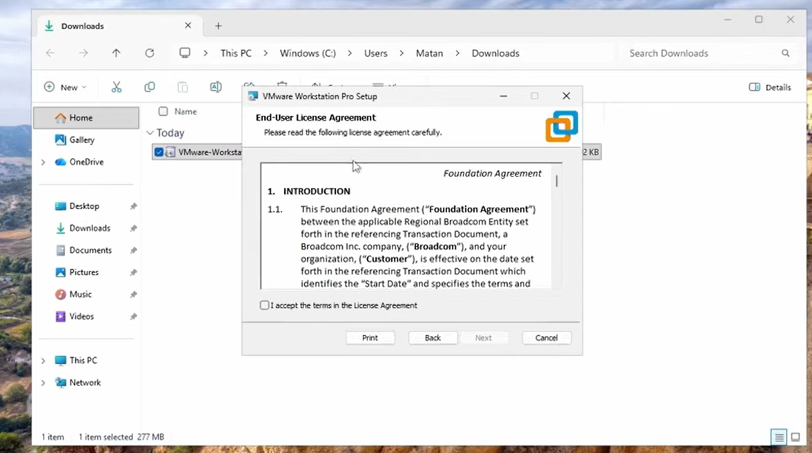
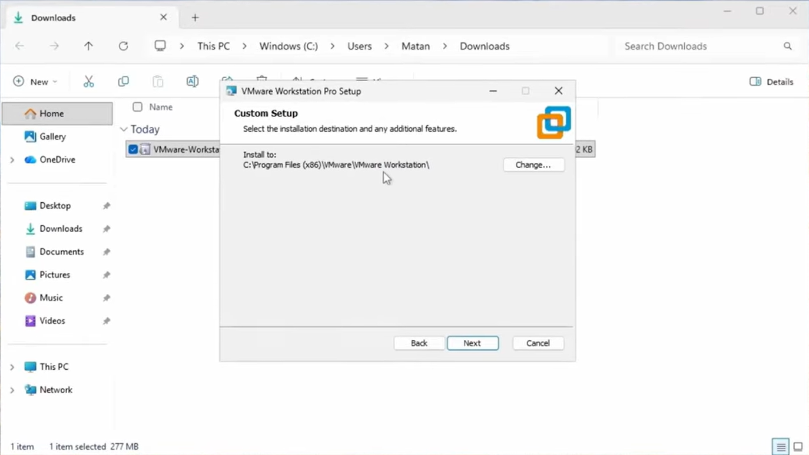
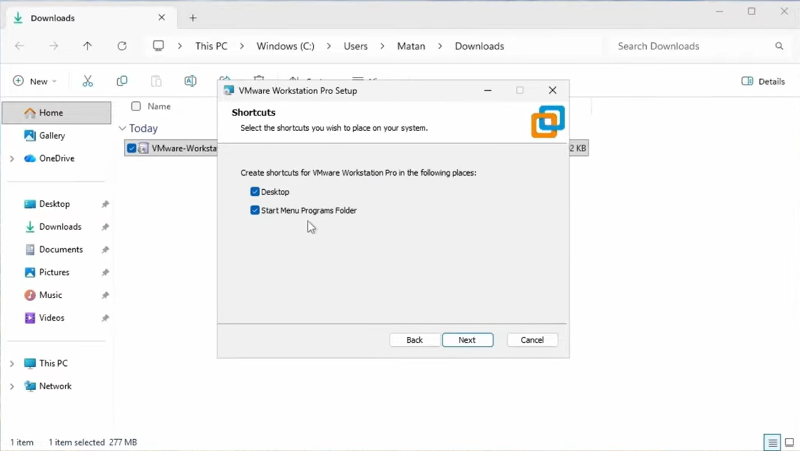

# Hướng dẫn cài đặt VMware Workstation Pro 17

Tài liệu này hướng dẫn chi tiết cách tải, cài đặt và cấu hình VMware Workstation Pro trên Windows để tạo và quản lý máy ảo.

---

## 📑 Mục lục

- [Hướng dẫn cài đặt VMware Workstation Pro 17](#hướng-dẫn-cài-đặt-vmware-workstation-pro-17)
  - [📑 Mục lục](#-mục-lục)
  - [1. Giới thiệu về VMware Workstation](#1-giới-thiệu-về-vmware-workstation)
  - [2. Yêu cầu hệ thống](#2-yêu-cầu-hệ-thống)
    - [Yêu cầu tối thiểu](#yêu-cầu-tối-thiểu)
  - [3. Tải VMware Workstation](#3-tải-vmware-workstation)
  - [4. Cài đặt VMware Workstation](#4-cài-đặt-vmware-workstation)
    - [🔸 Bước 1: Khởi động trình cài đặt](#-bước-1-khởi-động-trình-cài-đặt)
    - [🔸 Bước 2: Chấp nhận điều khoản](#-bước-2-chấp-nhận-điều-khoản)
    - [🔸 Bước 3: Chọn thư mục cài đặt](#-bước-3-chọn-thư-mục-cài-đặt)
    - [🔸 Bước 4: Cấu hình tùy chọn](#-bước-4-cấu-hình-tùy-chọn)
    - [🔸 Bước 5: Tạo shortcuts](#-bước-5-tạo-shortcuts)
    - [🔸 Bước 6: Hoàn tất cài đặt](#-bước-6-hoàn-tất-cài-đặt)
  - [5. Tài liệu liên quan](#5-tài-liệu-liên-quan)
---

## 1. Giới thiệu về VMware Workstation

**VMware Workstation Pro** là phần mềm ảo hóa hàng đầu cho Windows và Linux, cho phép:

- Chạy nhiều hệ điều hành đồng thời trên một máy tính
- Tạo môi trường phát triển và kiểm thử an toàn
- Snapshot và clone máy ảo
- Chia sẻ tài nguyên giữa host và guest OS

---

## 2. Yêu cầu hệ thống

### Yêu cầu tối thiểu

| Thành phần | Yêu cầu |
|-----------|---------|
| **Hệ điều hành** | Windows 10/11 (64-bit) |
| **CPU** | Intel Core i3 hoặc AMD tương đương |
| **RAM** | 4GB (khuyến nghị 8GB+) |
| **Ổ cứng trống** | 1.5GB cho VMware + dung lượng cho máy ảo |
| **VT-x/AMD-V** | Phải được bật trong BIOS |

> **Lưu ý:** Kiểm tra virtualization đã được bật trong BIOS/UEFI trước khi cài đặt.

---

## 3. Tải VMware Workstation

1. Truy cập trang chính thức của VMware:  
   https://www.vmware.com/products/workstation-pro.html

2. Chọn phiên bản phù hợp:
   - **VMware Workstation Pro** (đầy đủ tính năng, có bản dùng thử 30 ngày)
   - **VMware Workstation Player** (miễn phí cho mục đích cá nhân, ít tính năng hơn)

3. Nhấn **Download Now** và chọn phiên bản cho Windows.

4. Tải file cài đặt có tên dạng: `VMware-workstation-full-17.x.x-xxxxx.exe`

> **Gợi ý:** Nên tải phiên bản Pro để có đầy đủ tính năng như snapshot, clone, và quản lý nhiều VM.

---

## 4. Cài đặt VMware Workstation

### 🔸 Bước 1: Khởi động trình cài đặt

1. Nhấp chuột phải vào file `.exe` đã tải
2. Chọn **Run as Administrator**
3. Nhấn **Yes** khi UAC hỏi quyền

---

### 🔸 Bước 2: Chấp nhận điều khoản

1. Đọc và chấp nhận **End User License Agreement**
2. Đánh dấu ✓ **I accept the terms in the License Agreement**
3. Nhấn **Next**

---

### 🔸 Bước 3: Chọn thư mục cài đặt

1. Giữ nguyên đường dẫn mặc định hoặc chọn thư mục khác
2. Đường dẫn mặc định: `C:\Program Files (x86)\VMware\VMware Workstation\`
3. Nhấn **Next**

---

### 🔸 Bước 4: Cấu hình tùy chọn

Đánh dấu các tùy chọn khuyến nghị:
- ☐ **Check for product updates on startup** (tùy chọn)
- ☐ **Join the VMware Customer Experience Program.....** (tùy chọn)

Nhấn **Next** để tiếp tục.

---

### 🔸 Bước 5: Tạo shortcuts

Chọn nơi tạo shortcut:

- ✓ **Desktop** (tạo biểu tượng trên màn hình)
- ✓ **Start Menu Programs folder**

Nhấn **Next**.

---

### 🔸 Bước 6: Hoàn tất cài đặt

1. Xem lại các cấu hình đã chọn
2. Nhấn **Install** để bắt đầu cài đặt
3. Chờ quá trình cài đặt hoàn tất (3-5 phút)
4. Nhấn **Finish**

5. **Khởi động lại máy tính** nếu được yêu cầu

---

## 5. Tài liệu liên quan

Sau khi cài đặt VMware Workstation, bạn có thể tham khảo:

- [Hướng dẫn cài đặt Ubuntu 22.04 LTS trên VMware](huong-dan-cai-dat-ubuntu.md)
- [Hướng dẫn cài đặt VS Code](huong-dan-cai-dat-vscode.md)
---
