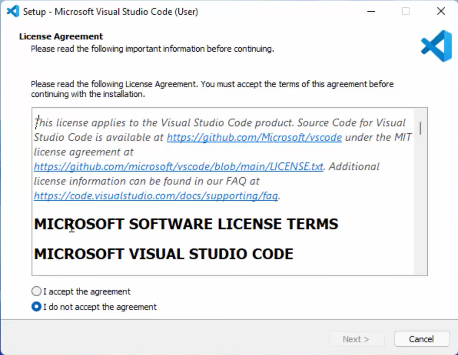
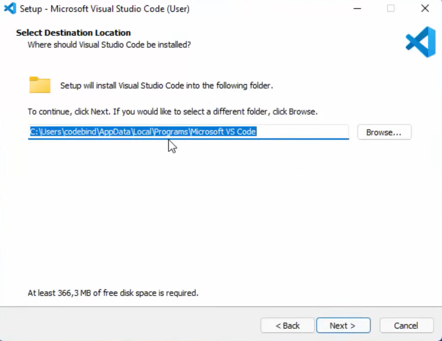

# Hướng dẫn cài đặt Visual Studio Code

Tài liệu này hướng dẫn chi tiết cách tải, cài đặt và cấu hình Visual Studio Code trên Windows cho lập trình Embedded Linux.

---

## 📑 Mục lục

- [Hướng dẫn cài đặt Visual Studio Code](#hướng-dẫn-cài-đặt-visual-studio-code)
  - [📑 Mục lục](#-mục-lục)
  - [1. Giới thiệu về Visual Studio Code](#1-giới-thiệu-về-visual-studio-code)
  - [2. Yêu cầu hệ thống](#2-yêu-cầu-hệ-thống)
    - [Yêu cầu tối thiểu](#yêu-cầu-tối-thiểu)
  - [3. Tải Visual Studio Code](#3-tải-visual-studio-code)
  - [4. Cài đặt Visual Studio Code](#4-cài-đặt-visual-studio-code)
    - [🔸 Bước 1: Khởi động trình cài đặt](#-bước-1-khởi-động-trình-cài-đặt)
    - [🔸 Bước 2: Chấp nhận điều khoản](#-bước-2-chấp-nhận-điều-khoản)
    - [🔸 Bước 3: Chọn thư mục cài đặt](#-bước-3-chọn-thư-mục-cài-đặt)
    - [🔸 Bước 4: Cấu hình tùy chọn](#-bước-4-cấu-hình-tùy-chọn)
    - [🔸 Bước 5: Hoàn tất cài đặt](#-bước-5-hoàn-tất-cài-đặt)
  - [5. Cài đặt Extensions cần thiết](#5-cài-đặt-extensions-cần-thiết)
    - [🔹 Extensions cho Embedded Linux \& C/C++](#-extensions-cho-embedded-linux--cc)
    - [🔹 Extensions tiện ích](#-extensions-tiện-ích)
    - [Cách cài đặt Extensions](#cách-cài-đặt-extensions)
  - [6. Tài liệu liên quan](#6-tài-liệu-liên-quan)

---

## 1. Giới thiệu về Visual Studio Code

**Visual Studio Code (VS Code)** là trình soạn thảo mã nguồn miễn phí, mạnh mẽ từ Microsoft, hỗ trợ:

- Lập trình đa ngôn ngữ (C/C++, Python, JavaScript, v.v.)
- Tích hợp Git và terminal
- Debug trực tiếp trong editor
- Remote development qua SSH
- Hệ sinh thái extensions phong phú

---

## 2. Yêu cầu hệ thống

### Yêu cầu tối thiểu

| Thành phần | Yêu cầu |
|-----------|---------|
| **Hệ điều hành** | Windows 10/11 (64-bit) |
| **CPU** | 1.6 GHz trở lên |
| **RAM** | 1GB (khuyến nghị 2GB+) |
| **Ổ cứng trống** | 200MB |

---

## 3. Tải Visual Studio Code

1. Truy cập trang chính thức:  
   https://code.visualstudio.com

2. Nhấn nút **Download for Windows**

3. Tải file cài đặt:
   - **User Installer** (khuyến nghị): Cài cho user hiện tại
   - **System Installer**: Cài cho tất cả users (cần quyền admin)

4. File tải về có dạng: `VSCodeUserSetup-x64-1.x.x.exe`

> **Gợi ý:** Chọn **User Installer** để dễ dàng cập nhật và không cần quyền admin.

---

## 4. Cài đặt Visual Studio Code

Cách truy cập chi tiết các bước cài đặt có thể tham khảo hướng dẫn: https://code.visualstudio.com/docs/setup/windows

### 🔸 Bước 1: Khởi động trình cài đặt

1. Nhấp đôi vào file `.exe` đã tải
2. Chờ trình cài đặt khởi động

---

### 🔸 Bước 2: Chấp nhận điều khoản

1. Đọc **License Agreement**
2. Chọn **I accept the agreement**
3. Nhấn **Next**

---

### 🔸 Bước 3: Chọn thư mục cài đặt

1. Giữ nguyên đường dẫn mặc định hoặc chọn thư mục khác
2. Đường dẫn mặc định: `C:\Users\[Username]\AppData\Local\Programs\Microsoft VS Code`
3. Nhấn **Next**

---

### 🔸 Bước 4: Cấu hình tùy chọn

Đánh dấu các tùy chọn **khuyến nghị**:

- ✓ **Add "Open with Code" action to Windows Explorer file context menu**
- ✓ **Add "Open with Code" action to Windows Explorer directory context menu**
- ✓ **Register Code as an editor for supported file types**
- ✓ **Add to PATH** (quan trọng - cho phép mở VS Code từ terminal)

Nhấn **Next** để tiếp tục.

---

### 🔸 Bước 5: Hoàn tất cài đặt

1. Xem lại các cấu hình đã chọn
2. Nhấn **Install** để bắt đầu cài đặt
3. Chờ quá trình cài đặt hoàn tất (1-2 phút)
4. Đánh dấu ✓ **Launch Visual Studio Code**
5. Nhấn **Finish**

---

## 5. Cài đặt Extensions cần thiết

Sau khi mở VS Code lần đầu, cài đặt các extensions sau:

### 🔹 Extensions cho Embedded Linux & C/C++

| Extension | Mô tả | Cách cài |
|-----------|-------|----------|
| **Remote - SSH** | Kết nối và lập trình trên máy ảo Ubuntu | `Ctrl+Shift+X` → tìm "Remote - SSH" |
| **C/C++** | IntelliSense, debugging cho C/C++ | Tìm "C/C++" (Microsoft) |
| **CMake Tools** | Hỗ trợ CMake build system | Tìm "CMake Tools" |
| **CMake** | Syntax highlighting cho CMake | Tìm "CMake" |

### 🔹 Extensions tiện ích

| Extension | Mô tả |
|-----------|-------|
| **GitLens** | Tăng cường Git integration |
| **Markdown Preview Enhanced** | Preview file Markdown |
| **Better Comments** | Highlight comments theo màu |
| **Error Lens** | Hiển thị lỗi inline |

---

### Cách cài đặt Extensions

1. Nhấn `Ctrl + Shift + X` hoặc click biểu tượng Extensions ở sidebar
2. Tìm tên extension trong ô search
3. Nhấn **Install**

---

## 6. Tài liệu liên quan

Sau khi cài đặt VS Code, bạn có thể tham khảo:

- [Hướng dẫn cài đặt VMware Workstation](huong-dan-cai-dat-vmware-workstation.md)
- [Hướng dẫn cài đặt Ubuntu 22.04 LTS trên VMware](huong-dan-cai-dat-ubuntu.md)

---
