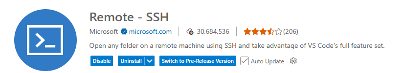
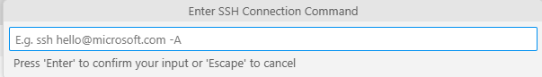

# Hướng dẫn SSH từ VS Code vào máy ảo VMware Ubuntu

Tài liệu này hướng dẫn chi tiết cách thiết lập kết nối SSH từ Visual Studio Code trên Windows đến máy ảo Ubuntu chạy trên VMware Workstation.

---

## 📑 Mục lục

- [Hướng dẫn SSH từ VS Code vào máy ảo VMware Ubuntu](#hướng-dẫn-ssh-từ-vs-code-vào-máy-ảo-vmware-ubuntu)
  - [📑 Mục lục](#-mục-lục)
  - [1. Giới thiệu về Remote SSH](#1-giới-thiệu-về-remote-ssh)
  - [2. Yêu cầu trước khi bắt đầu](#2-yêu-cầu-trước-khi-bắt-đầu)
    - [✅ Checklist](#-checklist)
    - [Kiểm tra Extension Remote - SSH](#kiểm-tra-extension-remote---ssh)
  - [3. Cài đặt SSH Server trên Ubuntu](#3-cài-đặt-ssh-server-trên-ubuntu)
    - [🔸 Bước 1: Cập nhật package list](#-bước-1-cập-nhật-package-list)
    - [🔸 Bước 2: Cài đặt OpenSSH Server](#-bước-2-cài-đặt-openssh-server)
    - [🔸 Bước 3: Kiểm tra trạng thái SSH](#-bước-3-kiểm-tra-trạng-thái-ssh)
    - [🔸 Bước 4: Cho phép SSH qua firewall](#-bước-4-cho-phép-ssh-qua-firewall)
  - [4. Lấy địa chỉ IP của Ubuntu](#4-lấy-địa-chỉ-ip-của-ubuntu)
    - [Cách 1: Sử dụng lệnh `ip a`](#cách-1-sử-dụng-lệnh-ip-a)
    - [Cách 2: Sử dụng lệnh `hostname -I`](#cách-2-sử-dụng-lệnh-hostname--i)
    - [Ghi chú IP](#ghi-chú-ip)
  - [5. Cấu hình SSH trong VS Code](#5-cấu-hình-ssh-trong-vs-code)
    - [🔸 Bước 1: Mở Remote-SSH](#-bước-1-mở-remote-ssh)
    - [🔸 Bước 2: Thêm SSH Host](#-bước-2-thêm-ssh-host)
    - [🔸 Bước 3: Chọn file config](#-bước-3-chọn-file-config)
    - [Chỉnh sửa SSH Config (Tùy chọn)](#chỉnh-sửa-ssh-config-tùy-chọn)
  - [6. Kết nối đến máy ảo Ubuntu](#6-kết-nối-đến-máy-ảo-ubuntu)
    - [🔸 Bước 1: Mở Remote Explorer](#-bước-1-mở-remote-explorer)
    - [🔸 Bước 2: Chọn SSH Host](#-bước-2-chọn-ssh-host)
    - [🔸 Bước 3: Chọn platform](#-bước-3-chọn-platform)
    - [🔸 Bước 4: Nhập mật khẩu](#-bước-4-nhập-mật-khẩu)
    - [🔸 Bước 5: Kiểm tra kết nối](#-bước-5-kiểm-tra-kết-nối)
  - [7. Xử lý sự cố thường gặp](#7-xử-lý-sự-cố-thường-gặp)
    - [❌ Lỗi: "Could not establish connection"](#-lỗi-could-not-establish-connection)
    - [❌ Lỗi: "Permission denied"](#-lỗi-permission-denied)
    - [❌ Lỗi: "Network unreachable"](#-lỗi-network-unreachable)
    - [💡 Tips: Sử dụng SSH Key (Nâng cao)](#-tips-sử-dụng-ssh-key-nâng-cao)
  - [8. Tài liệu liên quan](#8-tài-liệu-liên-quan)

---

## 1. Giới thiệu về Remote SSH

**Remote - SSH** là extension của VS Code cho phép:

- Kết nối và lập trình trực tiếp trên máy ảo Ubuntu
- Sử dụng terminal, debugger, và extensions trên remote machine
- Đồng bộ code giữa Windows và Ubuntu
- Phát triển ứng dụng trong môi trường Linux từ Windows

---

## 2. Yêu cầu trước khi bắt đầu

### ✅ Checklist

- [x] VMware Workstation đã cài đặt
- [x] Máy ảo Ubuntu 22.04 LTS đã cài đặt và chạy
- [x] VS Code đã cài đặt trên Windows
- [x] Extension **Remote - SSH** đã cài trong VS Code

### Kiểm tra Extension Remote - SSH

1. Mở VS Code
2. Nhấn `Ctrl + Shift + X`
3. Tìm **Remote - SSH**
4. Nếu chưa có, nhấn **Install**



---

## 3. Cài đặt SSH Server trên Ubuntu

Mặc định Ubuntu Desktop không cài sẵn SSH Server. Cần cài đặt `openssh-server`:

### 🔸 Bước 1: Cập nhật package list

Mở Terminal trong Ubuntu (`Ctrl + Alt + T`):

```bash
sudo apt update
```

---

### 🔸 Bước 2: Cài đặt OpenSSH Server

```bash
sudo apt install openssh-server -y
```

---

### 🔸 Bước 3: Kiểm tra trạng thái SSH

```bash
sudo systemctl status ssh
```

Kết quả hiển thị:
- **Active: active (running)** → SSH đã hoạt động ✅
- Nếu chưa chạy, khởi động bằng: `sudo systemctl start ssh`


---

### 🔸 Bước 4: Cho phép SSH qua firewall

```bash
sudo ufw allow ssh
sudo ufw enable
```

> **Lưu ý:** Nếu không dùng firewall, có thể bỏ qua bước này.

---

## 4. Lấy địa chỉ IP của Ubuntu

### Cách 1: Sử dụng lệnh `ip a`

Trong Terminal Ubuntu:

```bash
ip a
```

Tìm interface **ens33** hoặc **eth0**, xem dòng `inet`:

```
inet 192.168.xxx.xxx/24
```

---

### Cách 2: Sử dụng lệnh `hostname -I`

```bash
hostname -I
```

Kết quả hiển thị trực tiếp IP, ví dụ: `192.168.174.128`

---

### Ghi chú IP

Ghi lại địa chỉ IP này, ví dụ:
- **IP Ubuntu:** `192.168.174.128`
- **Username:** `embedded` (hoặc username bạn đã tạo khi cài Ubuntu)

---

## 5. Cấu hình SSH trong VS Code

### 🔸 Bước 1: Mở Remote-SSH

1. Mở VS Code trên Windows
2. Nhấn `Ctrl + Shift + P` để mở Command Palette
3. Gõ: **Remote-SSH: Add New SSH Host**
4. Chọn lệnh này



---

### 🔸 Bước 2: Thêm SSH Host

Nhập lệnh SSH theo cú pháp:

```
ssh username@ip_address
```

Ví dụ:

```
ssh embedded@192.168.174.128
```

Nhấn **Enter**.

---

### 🔸 Bước 3: Chọn file config

VS Code sẽ hỏi chọn file config để lưu:

- Chọn file đầu tiên: `C:\Users\[YourUsername]\.ssh\config`

Nhấn **Enter** để xác nhận.

---

### Chỉnh sửa SSH Config (Tùy chọn)

Để dễ quản lý, có thể chỉnh sửa file config:

1. Nhấn `Ctrl + Shift + P` → **Remote-SSH: Open SSH Configuration File**
2. Chọn file config vừa tạo
3. Chỉnh sửa như sau:

```
Host ubuntu-vm
    HostName 192.168.174.128
    User embedded
    Port 22
```

**Giải thích:**
- `Host ubuntu-vm`: Tên hiển thị (có thể đặt tùy ý)
- `HostName`: Địa chỉ IP của Ubuntu
- `User`: Username Ubuntu
- `Port`: Cổng SSH (mặc định 22)

---

## 6. Kết nối đến máy ảo Ubuntu

### 🔸 Bước 1: Mở Remote Explorer

1. Click biểu tượng **Remote Explorer** ở sidebar bên trái
2. Hoặc nhấn `Ctrl + Shift + P` → **Remote-SSH: Connect to Host**


---

### 🔸 Bước 2: Chọn SSH Host

Trong danh sách SSH Targets, chọn host vừa tạo:
- `ubuntu-vm` (nếu đã đặt tên)
- hoặc `192.168.174.128`

Click vào biểu tượng **Connect in New Window** (→)

---

### 🔸 Bước 3: Chọn platform

Lần đầu kết nối, VS Code sẽ hỏi platform:
- Chọn **Linux**

---

### 🔸 Bước 4: Nhập mật khẩu

Nhập mật khẩu của user Ubuntu:

> **Gợi ý:** Có thể đánh dấu **Remember password** để không phải nhập lại.

---

### 🔸 Bước 5: Kiểm tra kết nối

Sau khi kết nối thành công:

1. Góc dưới trái VS Code hiển thị: **SSH: ubuntu-vm** (hoặc IP)
2. Mở Terminal trong VS Code (`Ctrl + ~`)
3. Chạy lệnh kiểm tra:

```bash
uname -a
```

Kết quả hiển thị thông tin Ubuntu:

```
Linux ubuntu-vm 5.15.0-xxx-generic #xxx-Ubuntu SMP ... x86_64 GNU/Linux
```

✅ **Kết nối thành công!**

---

## 7. Xử lý sự cố thường gặp

### ❌ Lỗi: "Could not establish connection"

**Nguyên nhân:**
- IP sai hoặc đã thay đổi
- SSH server chưa chạy trên Ubuntu
- Firewall chặn kết nối

**Giải pháp:**

1. Kiểm tra lại IP Ubuntu:
   ```bash
   hostname -I
   ```

2. Kiểm tra SSH server:
   ```bash
   sudo systemctl status ssh
   ```

3. Khởi động lại SSH nếu cần:
   ```bash
   sudo systemctl restart ssh
   ```

---

### ❌ Lỗi: "Permission denied"

**Nguyên nhân:**
- Username hoặc password sai

**Giải pháp:**
- Kiểm tra lại username và password Ubuntu
- Thử kết nối từ Windows Terminal để test:
  ```
  ssh embedded@192.168.174.128
  ```

---

### ❌ Lỗi: "Network unreachable"

**Nguyên nhân:**
- Máy ảo Ubuntu không có kết nối mạng
- Chế độ mạng VMware chưa đúng

**Giải pháp:**

1. Kiểm tra network adapter trong VMware (NAT hoặc Bridged)
2. Trong Ubuntu, kiểm tra kết nối:
   ```bash
   ping 8.8.8.8
   ```
3. Khởi động lại network:
   ```bash
   sudo systemctl restart NetworkManager
   ```

---

### 💡 Tips: Sử dụng SSH Key (Nâng cao)

Để không phải nhập password mỗi lần kết nối, có thể dùng SSH key:

1. Trên Windows, tạo SSH key:
   ```powershell
   ssh-keygen -t rsa -b 4096
   ```

2. Copy public key sang Ubuntu:
   ```powershell
   type $env:USERPROFILE\.ssh\id_rsa.pub | ssh embedded@192.168.174.128 "cat >> ~/.ssh/authorized_keys"
   ```

3. Kết nối lại, không cần password

---

## 8. Tài liệu liên quan

Sau khi thiết lập SSH thành công, bạn có thể tham khảo:

- [Hướng dẫn cài đặt Visual Studio Code](huong-dan-cai-dat-vscode.md)
- [Hướng dẫn cài đặt Ubuntu 22.04 LTS trên VMware](huong-dan-cai-dat-ubuntu.md)
- [Hướng dẫn cài đặt VMware Workstation](huong-dan-cai-dat-vmware-workstation.md)

---
