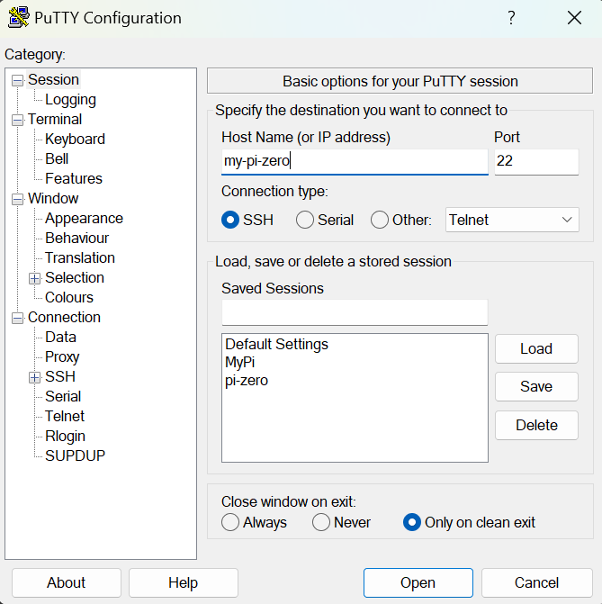
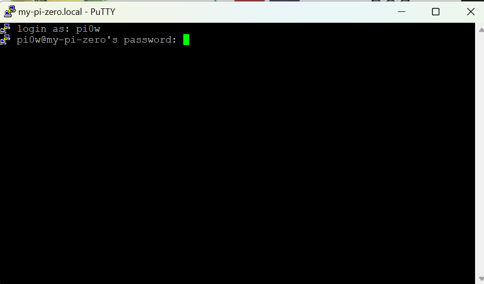
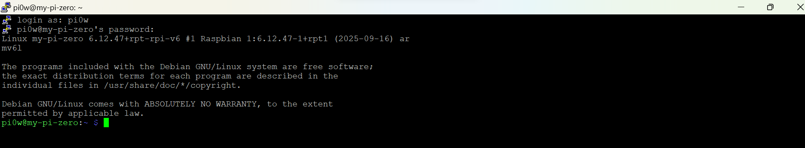
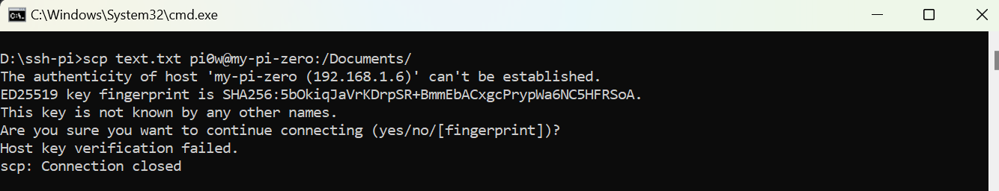
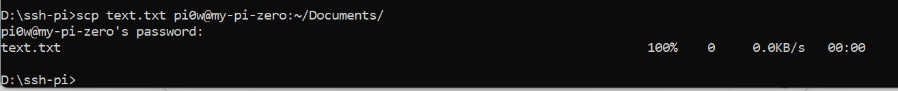

Ở bài viết trước chúng ta đã build image OS và bật kết nối SSH với Raspberry Pi. Trong bài viết này chúng ta sẽ tìm hiểu cách để gửi file qua Raspberry Pi bằng `scp`.

## Bước 1:
Sau khi flash image vào thẻ nhớ ta cắm thẻ nhớ vào Pi và cắp nguồn usb.

Đợi một lúc để Pi khởi động và kết nối wifi sau đó mở **Putty** để truy cập vào Pi (nhập hostname đã đặt trước đó):



Tiếp theo nhập user và password đã cài trước đó:



Kết nối thành công :



## Bước 2: 

Gửi file từ máy tính sang Raspberry Pi bằng `scp`. Mở cmd trên Window gõ lệnh :
``` bash
scp /path/to/file username@IP_RPI:/path/đích/
```

`IP_RPI` : có thể thay bằng hostname.

Ví dụ gửi file `text.txt` từ máy tính sang Pi:

```bash
D:\ssh-pi>scp text.txt pi0w@my-pi-zero:~/Documents/
```

Trường hợp gặp lỗi key:



Lỗi này xảy ra khi thay đổi user và hostname mặc định. Khắc phục bằng cách xóa key cũ:

```
ssh-keygen -R my-pi-zero
ssh-keygen -R 192.168.1.6
```



Kiểm tra trên Pi:


Như vậy chúng ta đã gửi thành công file tới Raspberry Pi qua `scp` .

