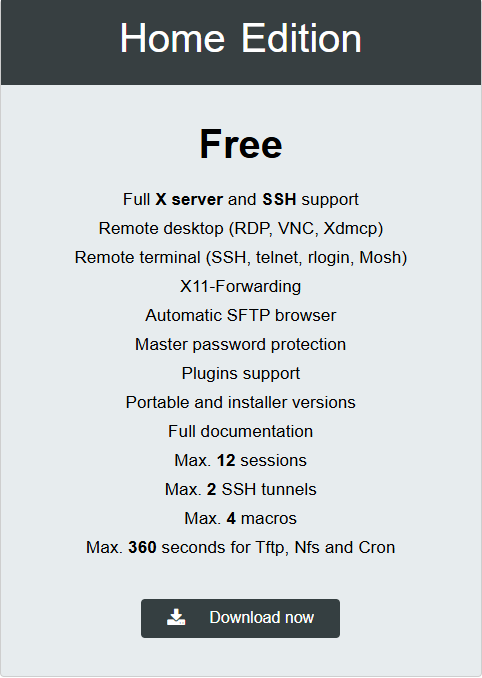
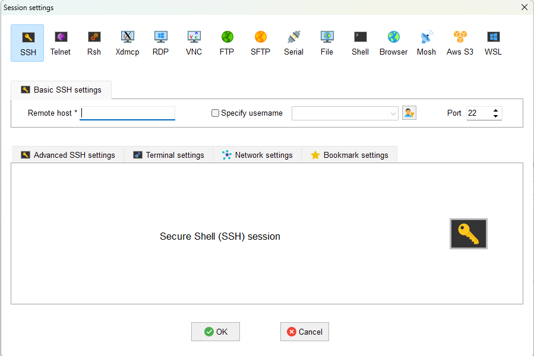
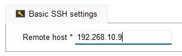

# Hướng dẫn cài đặt và sử dụng MobaXterm để kết nối SSH

Tài liệu này hướng dẫn cách tải, cài đặt và sử dụng MobaXterm để kết nối vào máy Ubuntu qua SSH.

---

## 📑 Mục lục

- [1. Tải phần mềm](#1-tải-phần-mềm)
- [2. Cài đặt MobaXterm](#2-cài-đặt-mobaxterm)
- [3. Kết nối SSH tới Ubuntu](#3-kết-nối-ssh-tới-ubuntu)

---

## 1. Tải phần mềm

1. Truy cập trang chủ:  
   https://mobaxterm.mobatek.net

2. Chọn:  
   **Home → GET MOBAXTERM NOW → Home Edition → Download Now**

### 🔸 Giao diện trang chủ

### 🔸 Chọn phiên bản Home để tải xuống

---

## 2. Cài đặt MobaXterm

1. Mở file `.exe` vừa tải.
2. Nhấn **Next** → **Install** để cài đặt.
3. Sau khi hoàn tất, mở ứng dụng **MobaXterm**.

---

## 3. Kết nối SSH tới Ubuntu

### 🔸 Bước 1: Mở MobaXterm

Chọn mục **Session** trên thanh công cụ.

### 🔸 Bước 2: Chọn chế độ SSH

### 🔸 Bước 3: Nhập địa chỉ IP của Ubuntu

Gõ IP của máy ảo hoặc thiết bị Ubuntu vào ô **Remote host**.

### 🔸 Bước 4: Đăng nhập

Nhập:

- Username Ubuntu  
- Password tương ứng

Sau khi đăng nhập thành công, bạn sẽ thấy terminal Ubuntu hiển thị trong cửa sổ MobaXterm.

---

