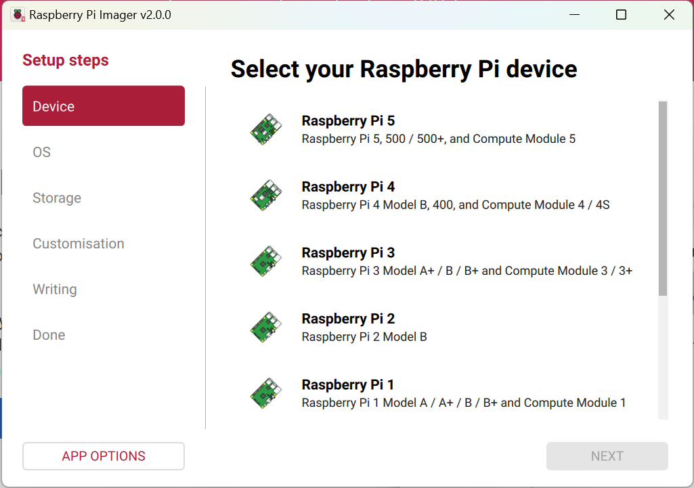
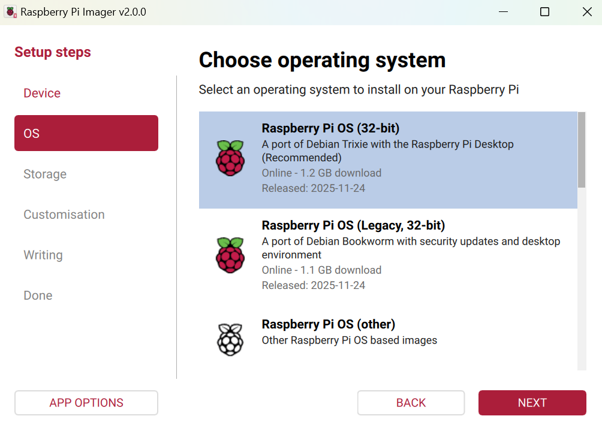
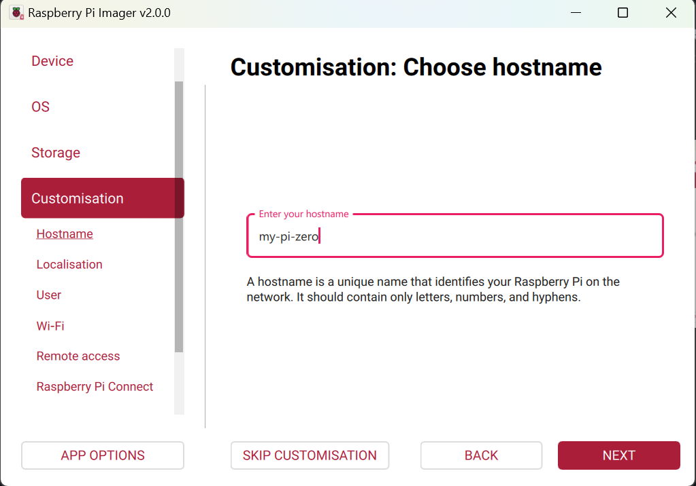
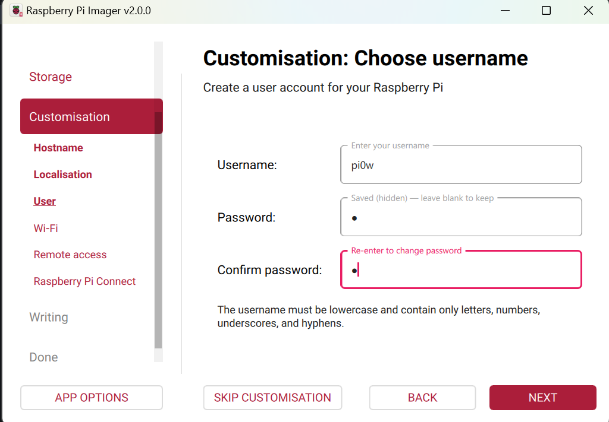
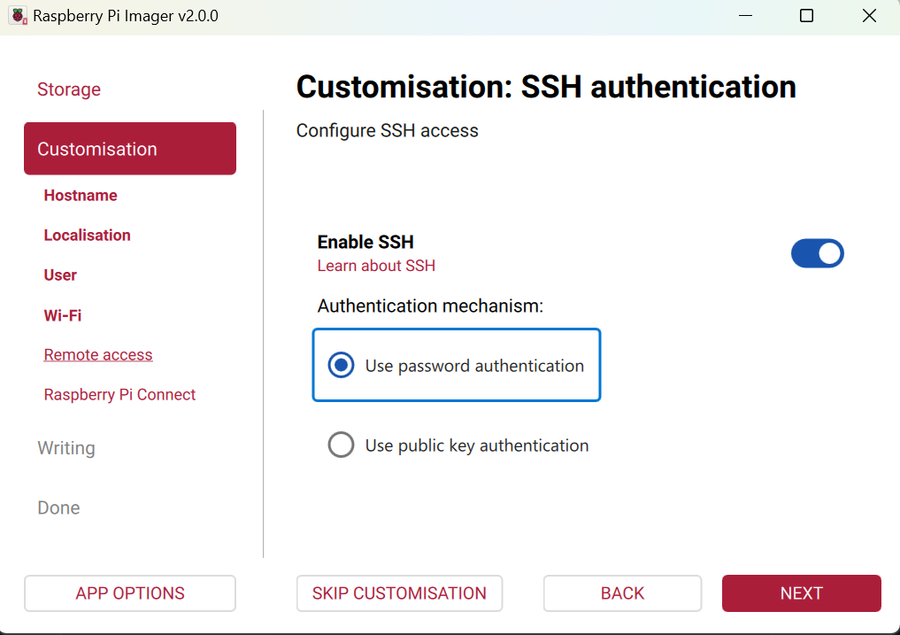
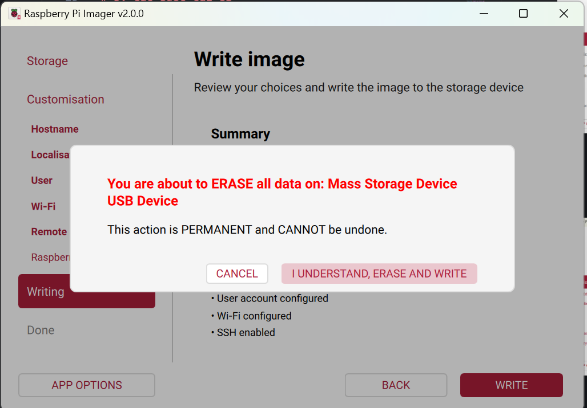

Trong bài viết này chúng ta sẽ cùng nhau tìm hiểu cách cài OS Linux lên Raspberry Pi Zero W. Đây có thể coi như bước khởi đầu quan trọng khi làm việc với Raspberry Pi.

# 1. Các thiết bị phần cứng cần thiết.

Ở trong bài viết này sẽ hướng dẫn thông qua board Raspberry Pi Zero W:

Để flash image OS chúng ta cần :

- 1 thẻ nhớ SD 16gb trở lên + 1 thiết bị đọc thẻ:

- 1 dây cáp usb cấp nguồn:

# 2. Phần mềm cần cài đặt

Phía nhà sản xuất cung cấp phần mềm Rasberry Pi Imager giúp việc khởi tạo image OS đơn giản, không tốn nhiều thời gian. Các bạn có thể tải ở link sau : [Rasberry Pi Imager Software](https://www.raspberrypi.com/software/)

Ngoài ra trong trường hợp không có màn hình và cáp hdmi ta cần tải các phần mềm kết nối ssh với Raspberry Pi như [**MobaXterm**](https://mobaxterm.mobatek.net/download.html) hoặc [**Putty**](https://putty.org/index.html).

# 3. Các bước tạo image OS 

Mở **Rasberry Pi Imager** và thực hiện các bước sau:

- **Bước 1** : Chọn loại board cần tạo image

- **Bước 2** : Lựa chọn loại OS cài đặt. Ở đây nhà sản xuất cung cấp nhiều loại OS với các tính năng bổ sung khác nhau, chi tiết xem tại đường dẫn sau [Raspberry Pi OS](https://www.raspberrypi.com/documentation/computers/os.html#get-raspberry-pi-os) .
Ở đây cơ bản chúng ta sẽ cài *Raspberry Pi OS 32 bit* được recommend:

- **Bước 3** : Cắm thẻ nhớ vào laptop và click chọn thẻ nhớ.

- **Bước 4** : Đặt hostname sẽ giúp bạn nhận ra thiết bị khi truy cập vào wifi.

- **Bước 5** : Cài location
  - Capital: Hanoi(Vietnam)
  - Time zone: Asia/Ho_Chi_Minh
  - Keyboard: us

- **Bước 6** : Cài username và password (nên cài password đơn giản ví dụ `1`)

- **Bước 7** : Bật ssh

- **Bước 8** : Có thể bỏ qua Raspberry Pi Connect và bắt đầu Write image chọn *Erase and Write*

- **Bước 9**: Chờ imager hoàn thành và check lại trong thẻ SD như vậy chúng ta đã thành công tạo image OS.

# 4. Kết nối Rasberry Pi qua SSH

Sau khi flash image vào thẻ nhớ ta cắm thẻ nhớ vào Pi và cắp nguồn usb.

Đợi một lúc để Pi khởi động và kết nối wifi sau đó mở **Putty** để truy cập vào Pi (nhập hostname đã đặt trước đó):

Tiếp theo nhập user và password đã cài trước đó:

Kết nối thành công :

***Note***: Trong trường hợp chưa thấy hostname để kiểm tra Raspberry Pi kết nối với wifi chưa chúng ta có thể check bằng phần mềm dò IP kết nối với mạng ví dụ như **Advanced IP Scaner**

# 5. Kết luận

Như vậy trong bài viết này đã hướng dẫn cách build image OS cho Raspberry Pi Zero W mà không cần dùng màn hình và bàn phím.

