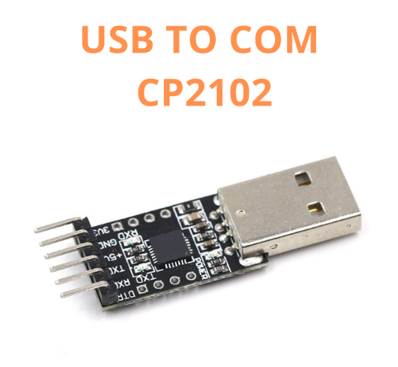
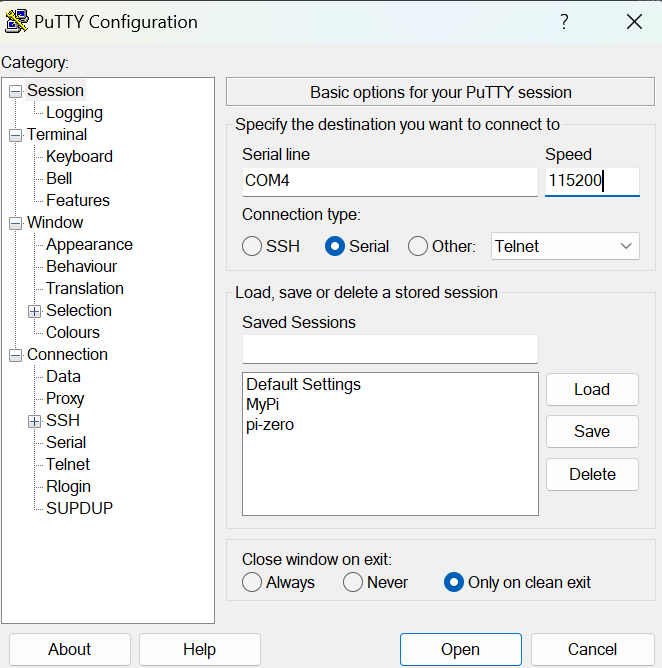
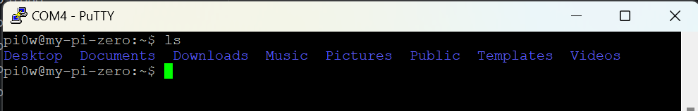

Ở bài viết trước chúng ta đã cùng nhau build image OS cho Raspbery Pi. Trong bài chia sẻ này, mình sẽ chia sẻ cách kết nối, điều khiển Raspberry Pi Zero W qua cổng Serial. 

Ưu điểm của cách kết nối này là có thể đồng thời cấp nguồn cho Pi của bạn và không cần bàn phím, chuột hay màn hình kết nối và làm việc với Pi. Bạn sẽ cần cài đặt phần mềm mô phỏng thiết bị đầu cuối ( ở đây là [**Putty**](https://putty.org/index.html)) nếu bạn sử dụng Windows, ngoài ra còn cần cài đặt Driver cần thiết. Raspberry Pi được tích hợp sẵn cổng giao tiếp nối tiếp Serial cho phép các thiết bị kết nối tới giao diện điều khiển dòng lệnh, đăng nhập và làm việc như một User.

# 1. Chuẩn bị
## 1.1. Raspberry Pi 
Ở trong bài viết này sẽ hướng dẫn thông qua board Raspberry Pi Zero W:

## 1.2. TTL to USB
Đầu chuyển đổi UART (TTL to USB) ở đây mình dùng CH2102:

# 2. Tiến hành
## 2.1. Cài driver uart
Ở đây nếu bạn dùng CP2102 thì bạn có thể cài driver ở đây [CP2102](https://www.silabs.com/software-and-tools/usb-to-uart-bridge-vcp-drivers?tab=downloads)

Sau đó vào **Device Manager** để kiểm tra port:

## 2.2. Kết nối
Sơ đồ kết nối như sau:
- TX (CH340) - RXD (Pi)
- RX (CH340) - TXD (Pi)
- GND (CH340) - GND (Pi)

Với Pinout của Raspberry Pi Zero W như sau:

## 2.3. Connect UART
Sau khi kết nối chân ta tiến hành mở phần mềm Putty
- Chọn cổng Serial
- Nhập cổng com
- Baudrate 115200

Sau khi open ta tiến hành nhập user và password đã cài trước đó và đăng nhập thành công

